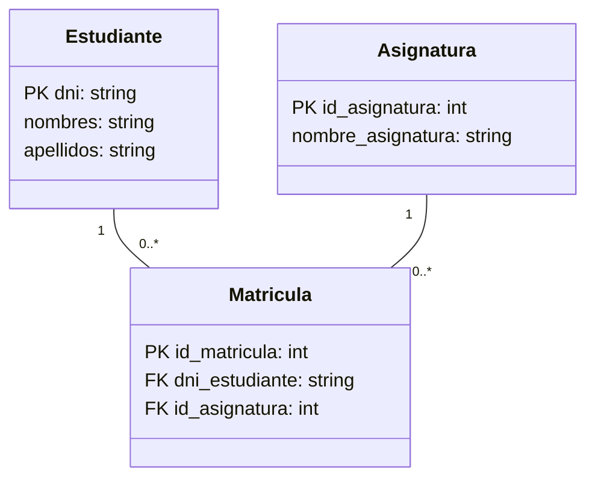
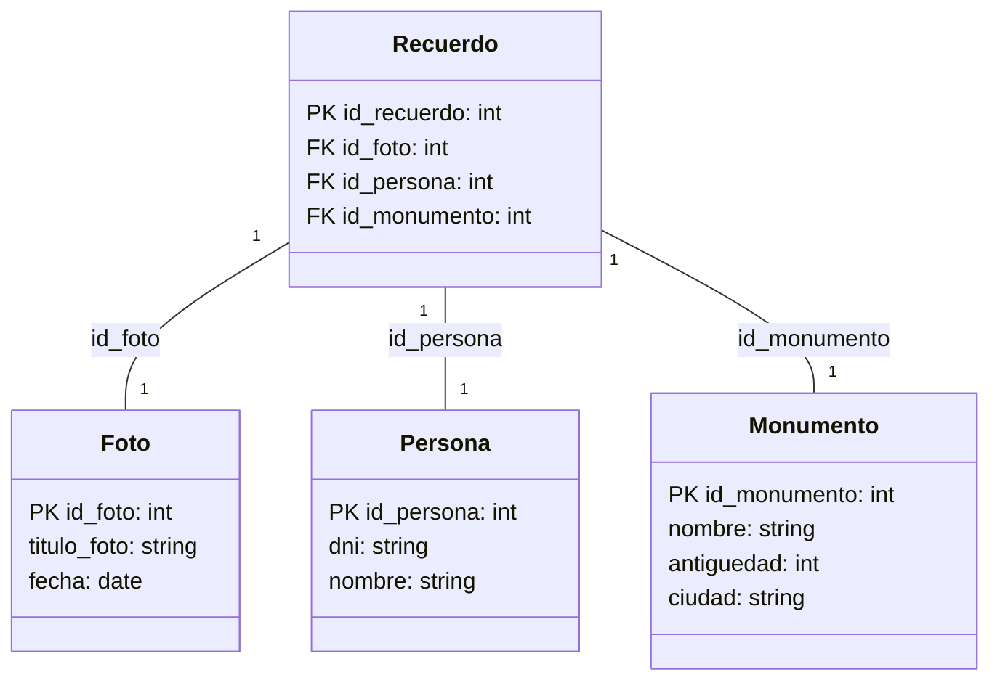

# Respuestas correspondientes al tema 5 (práctico)

### Diagrama físico pregunta 3

```mermaid
classDiagram
class Estudiante {
    PK dni: string
    nombres: string
    apellidos: string
}

class Asignatura {
    PK id_asignatura: int
    nombre_asignatura: string
}

class Matricula {
    PK id_matricula: int
    FK dni_estudiante: string
    FK id_asignatura: int
}

Estudiante "1" -- "0..*" Matricula
Asignatura "1" -- "0..*" Matricula
```

### Diagrama físico pregunta 4

```mermaid
classDiagram
class Persona {
    PK id_persona: int
    dni: string
    nombre: string
}

class Foto {
    PK  id_foto: int
    titulo_foto: string
    fecha: date
}

class Monumento {
    PK  id_monumento: int
    nombre: string
    antiguedad: int
    ciudad: string
}

class Recuerdo {
    PK  id_recuerdo: int
   FK id_foto: int
    FK id_persona: int
     FK id_monumento: int
}

Recuerdo "1" -- "1" Foto : id_foto
Recuerdo "1" -- "1" Persona : id_persona
Recuerdo "1" -- "1" Monumento : id_monumento
```
